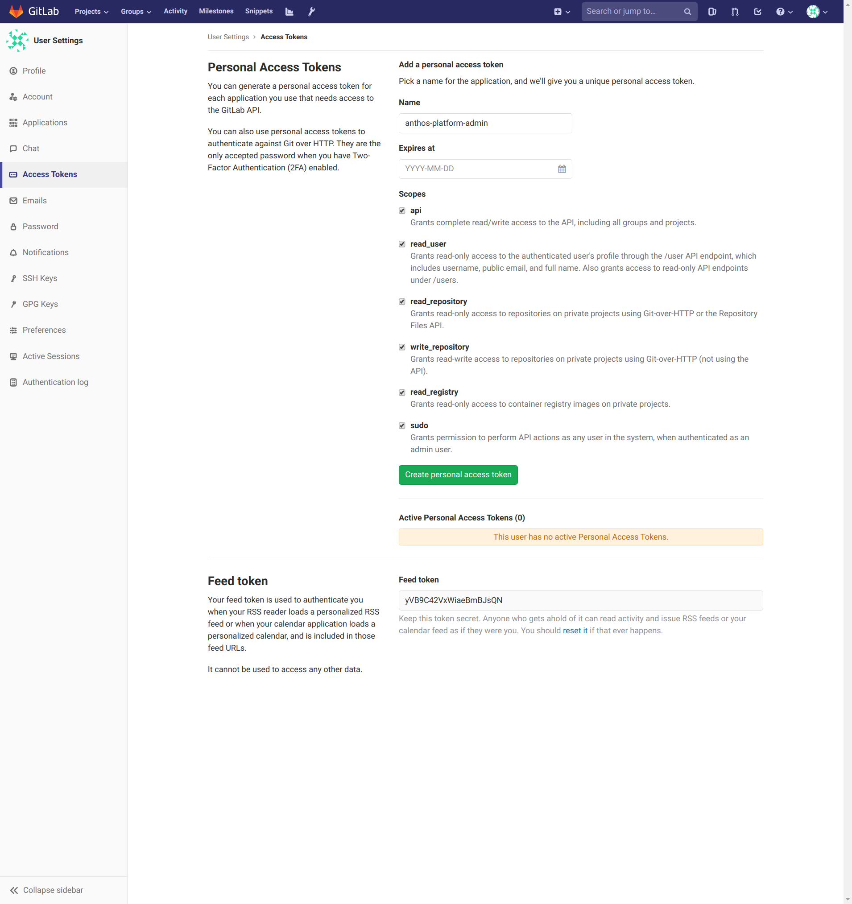

# Installation

1. Install Terraform, Helm and kubectl

1. Create a GCP project and activate it in your shell.

1. Replace your project ID in each of the terraform.tfvars files:

  ```shell
  PROJECT=$(gcloud config get-value project)
  sed -i 's/YOUR_PROJECT_ID/${PROJECT}/g' 0_foundation/terraform.tfvars
  vi 1_clusters/terraform.tfvars
  vi 2_gitlab/terraform.tfvars
  ```

1. Create foundational infrastructure (networks, subnetworks, etc)

  ```shell
  cd 0_foundation
  terraform init
  terraform plan # ensure no errors
  terraform apply # type yes to confirm
  cd ..
  ```

1. Create the GKE clusters that will be used for deployment, CI, etc.

  ```shell
  cd 1_clusters
  terraform init
  terraform plan # ensure no errors
  terraform apply # type yes to confirm
  cd ..
  ```

1. Install Gitlab, based on [this tutorial](https://cloud.google.com/solutions/deploying-production-ready-gitlab-on-gke).

  ```shell
  cd 2_gitlab
  terraform init
  terraform plan # ensure no errors
  terraform apply # type yes to confirm

  # Set DNS wildcard domain to point at the ingress ip
  ```

1. Log in to GitLab with the root user and password printed in the previous step.

1. Go to https://${GITLAB_HOSTNAME}/profile/personal_access_tokens, to create a sudo access token for project creation:



1. Run the script to populate repos in GitLab.

  ```shell
  ./create-repos.sh
  cd ..
  ```

1. Get the Gitlab registration from the Admin panel. (Overview->Runners)

1. Register a GitLab runner in the CI cluster.

  ```shell
  ./create-repos.sh
  helm repo add gitlab https://charts.gitlab.io
  helm fetch gitlab/gitlab-runner --version 0.9.1
  # Need to fix certs to be able to use https URL
  helm template gitlab-runner-0.9.1.tgz -n ci --set gitlabUrl=http://${YOUR_GITLAB_HOSTNAME} --set runnerRegistrationToken=${TOKEN}
  cd ..
  ```

1. Install Anthos Config Management in all of your clusters:

  ```shell
  cd 3_acm
  ./install_acm.sh
  cd ..
  ```

1. Configure a read only access token from your application repository that can be used for images to be pulled from GitLab. Go to Settings->Repository->Deploy Tokens, click "Expand".

Name it "anthos-platform-reader" and enable the "read_registry" scope.

Create a Kubernetes and add it to the ACM repo in your app namespace.

kubectl create secret docker-registry- -docker-server=https://registry.${DOMAIN} --docker-username=gitlab+deploy-token-1 --docker-password=<PASSWORD_FROM_UI> --dry-run gitlab-registry -o yaml > 2_gitlab/repos/anthos-config-management/namespaces/managed-apps/vic-test/gitlab-registry-secret.yaml

1. Commit that change back to the ACM repo.