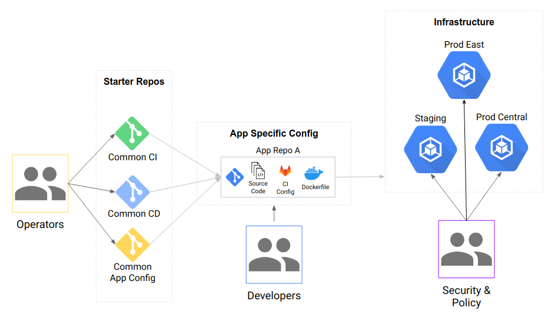

# Anthos Platform Demo Setup Instructions

Feedback and questions: cloud-sa-anthos-platform@google.com, or
open an issue: [New issue in Buganizer](https://b.corp.google.com/issues/new?component=759009&template=1357580)

For more information please visit:

* [go/anthos-platform](http://go/anthos-platform)
* [go/anthos-platform-tech-pitch](http://go/anthos-platform-tech-pitch)

For a user guide on what to do after the install, please go to:
[go/anthos-platform-demo](http://go/anthos-platform-demo)



## Pre-requisites

1. [Download](https://cloudsolutionsarchitects.git.corp.google.com/anthos-platform-setup/+archive/refs/heads/master.tar.gz) this repo to your local machine.

1. Untar the repo and go into the directory.

    ```shell
    mkdir -p anthos-platform-setup
    tar zxfv anthos-platform-setup-refs_heads_master.tar.gz -C anthos-platform-setup/
    cd anthos-platform-setup
    ```

1. [Install gcloud SDK](https://cloud.google.com/sdk/install).

1. [Create a new GCP project.](https://cloud.google.com/resource-manager/docs/creating-managing-projects#creating_a_project)

## Quick Start

1. Run the following commands to setup Cloud Build

    ```shell
    export PROJECT_ID=<INSERT_YOUR_PROJECT_ID>
    gcloud config set project ${PROJECT_ID}
    export PROJECT_NUMBER=$(gcloud projects describe ${PROJECT_ID} --format 'value(projectNumber)')
    gcloud services enable cloudbuild.googleapis.com
    gcloud services enable serviceusage.googleapis.com
    gcloud projects add-iam-policy-binding ${PROJECT_ID} --member serviceAccount:${PROJECT_NUMBER}@cloudbuild.gserviceaccount.com   --role roles/owner
    ```

1. Provision the address that GitLab will use.

    ```shell
    gcloud services enable compute.googleapis.com
    gcloud compute addresses create --region us-central1 gitlab
    ```

1. Create a DNS sub-domain using cloud-tutorial.dev

    ```shell
    # Set this to a custom subdomain if youd like it to be more memorable
    export SUBDOMAIN=ap-$(date +%s)
    curl -sL -o claim.sh https://claim.anthos-platform.dev/claim.sh
    chmod +x claim.sh
    ./claim.sh ${SUBDOMAIN}
    rm claim.sh
    ```

1. Map your gitlab address above to your domain.

    ```shell
    export GITLAB_ADDRESS=$(gcloud compute addresses list --filter="name=('gitlab')" --format "value(address)")
    gcloud dns record-sets transaction start --zone ${SUBDOMAIN}-zone
    gcloud dns record-sets transaction add ${GITLAB_ADDRESS} --name "*.${SUBDOMAIN}.demo.anthos-platform.dev" --type A --zone ${SUBDOMAIN}-zone --ttl 300
    gcloud dns record-sets transaction execute --zone ${SUBDOMAIN}-zone
    ```

1. Run Cloud Build to create the necessary resources. This takes around 30 minutes.

    ```shell
    export DOMAIN=${SUBDOMAIN}.demo.anthos-platform.dev
    gcloud builds submit --substitutions=_DOMAIN=${DOMAIN}
    ```

1. Log in to your GitLab instance with the URL, username and password printed at the end of the build. Hang on to this password, you will need it for later steps.

1. Follow the steps in [go/anthos-platform-demo](http://go/anthos-platform-demo) to go through a user journey (add, deploy, and change applications).

## Securing the ACM repository

At this stage, you should have a working ACM installation good enough for most
demos. If you want to follow production best practices, read
[Best practices for policy management with Anthos Config Management and GitLab](https://cloud.google.com/solutions/best-practices-for-policy-management-with-anthos-config-management).

Always leave at least one namespace defined in `namespaces/managed-apps`, otherwise ACM will
stop syncing.

## Contributing

To contribute follows these instrcutions for the development flow:

1. [Setup Local Repo](https://docs.google.com/document/d/1DMIAlcSmh6LaqkGLNxDunP6O_zpwPSchA0ywcSWdlXQ/edit#heading=h.w7ieayamciyz)

    ```shell
    git clone sso://cloudsolutionsarchitects/anthos-platform-setup
    cd anthos-platform-setup
    ```

1. [Configure the Gerrit Commit Hook Script](https://docs.google.com/document/d/1DMIAlcSmh6LaqkGLNxDunP6O_zpwPSchA0ywcSWdlXQ/edit#heading=h.csxq7bbwjeox)

    ```shell
    hookfile=`git rev-parse --git-dir`/hooks/commit-msg
    mkdir -p $(dirname $hookfile)
    curl -Lo $hookfile \
      https://gerrit-review.googlesource.com/tools/hooks/commit-msg
    chmod +x $hookfile
    unset hookfile
    ```

1. Make your changes and commit them. Make sure your commit includes the auto-populated `Change-Id:` line in the message.

1. [Push the commit to Gerrit for review](https://docs.google.com/document/d/1DMIAlcSmh6LaqkGLNxDunP6O_zpwPSchA0ywcSWdlXQ/edit#heading=h.e4h88uajgibc)

    ```shell
    git push origin HEAD:refs/for/devel
    ```

  A link to your review request will be printed.

## TODOs

### Demo

* Instructions on how to add a cluster (on-prem or GKE) (smchgee@)

### Starter repos

* Add more [kustomize bases](starter-repos/shared-kustomize-bases) (Java, Python, Ruby, etc), currently only have Go
* Add more [CI/CD patterns](starter-repos/shared-ci-cd) (Java, Ruby, Python, etc)

### Alternative tools

* Jenkins for CI/CD
* GitHub Enterprise for SCM
* Artifactory as the registry
* App Delivery for CD/rollout
