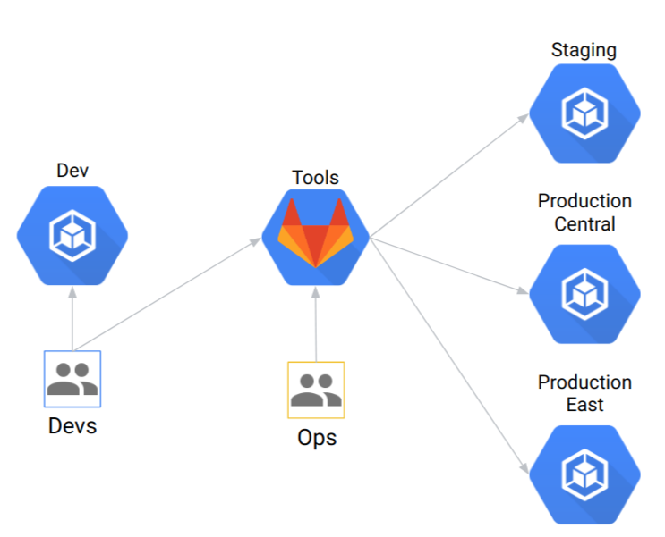

# Modern CI/CD with Anthos


* [Introduction](#introduction)
* [Architecture Overview](#architecture-overview)
* Quick Start
  * [Pre-requisites](#pre-requisites)
  * [Build Infrastructure](#build-infrastructure)
  * [Clean up](#clean-up)
* [Securing the ACM repository](#securing-the-acm-repository)

## Introduction

Kubernetes has given us wonderful abstraction that we can use to optimize the way we
develop, deploy, and maintain software projects across multiple environments.
In many cases though, Kubernetes is too complex for end users to learn and feel empowered with.
To alleviate this learning curve, many teams
are looking to build platform abstractions on top of Kubernetes to streamline onboarding and
reduce maintenenance for software projects.

In this repository we lay out a prescriptive way to create a multi-team software delivery platform
using Anthos. The platform has the following capabilities:

* Allow platform administrators to create and update best practices for provisioning apps
* Ensure App Developers can iterate independently in their own "landing zones" without interfering with each other
* Allow security teams to seamlessly implement and propagate policy across the platform
* Use GitOps for deployment

For more details, please watch [this talk on Youtube](https://www.youtube.com/watch?v=MOALiliVoeg).

## Architecture Overview

After the [Quick Start](#pre-requisites) you will have the following infra:



* [GitLab deployed on GKE](https://cloud.google.com/solutions/deploying-production-ready-gitlab-on-gke) to host your source code repostitories
* 1 Dev cluster that can be used for iterative development with tools like [Skaffold](https://skaffold.dev/)
* 1 Staging cluster
* 2 Production clusters in different GCP regions

Within GitLab you will have the following repo structure:


[Starter repos](starter-repos/) have examples for:

* [CI stages/steps](starter-repos/shared-ci-cd/ci/)
* [CD methodologies](starter-repos/shared-ci-cd/cd/)
* [Kubernetes configs](starter-repos/shared-kustomize-bases/) (via Kustomize)
* An example [application repo](starter-repos/golang-template/) for a Go app

## Pre-requisites

1. Clone this repo to your local machine.

1. [Install gcloud SDK](https://cloud.google.com/sdk/install).

1. [Create a new GCP project.](https://cloud.google.com/resource-manager/docs/creating-managing-projects#creating_a_project)

    <!-- TODO Find URL-->
1. Enable billing for GCP project

    <!-- TODO Link for regions -->
1. Set the `us-central1` region to deploy infrastructure

    ```shell
    export REGION="us-central1"
    gcloud config set compute/region ${REGION}
    ```

### Build Infrastructure

1. Run the following commands to setup Cloud Build

    ```shell
    export PROJECT_ID=<INSERT_YOUR_PROJECT_ID>
    gcloud config set core/project ${PROJECT_ID}
    export PROJECT_NUMBER=$(gcloud projects describe ${PROJECT_ID} --format 'value(projectNumber)')
    gcloud services enable cloudbuild.googleapis.com
    gcloud services enable anthos.googleapis.com
    gcloud services enable serviceusage.googleapis.com
    gcloud services enable binaryauthorization.googleapis.com
    gcloud services enable cloudkms.googleapis.com
    gcloud services enable containeranalysis.googleapis.com
    gcloud services enable secretmanager.googleapis.com
    gcloud projects add-iam-policy-binding ${PROJECT_ID} --member serviceAccount:${PROJECT_NUMBER}@cloudbuild.gserviceaccount.com --role roles/owner
    gcloud projects add-iam-policy-binding ${PROJECT_ID} --member serviceAccount:${PROJECT_NUMBER}@cloudbuild.gserviceaccount.com --role roles/containeranalysis.admin
    ```

1. Run Cloud Build to create the necessary resources.

    ```shell
    gcloud builds submit --substitutions=_PROJECT_ID=${PROJECT_ID}
    ```

    > :warning: This operation may take up to 30 minutes depending on region. Do not close the console or connection as the operation is NOT idempotent. If a failure occurs, [clean up](#clean-up) the environment and attempt again.

1. Log in to your GitLab instance with the URL, username and password printed at the end of the build. Hang on to this password, you will need it for later steps.

1. Follow the steps in the [docs](docs/index.md) to go through a user journey (add, deploy, and change applications).

### Important Variables

1. Take note and record the Password for your Gitlab account.
1. URL for Gitlab

    ```shell
    echo "https://gitlab.endpoints.${PROJECT_ID}.cloud.goog"
    ```
1. User and Password for GitLab are stored in the [Secrets Manager](https://cloud.google.com/secret-manager)

```shell
export GITLAB_USER=$(gcloud secrets versions access latest --secret="gitlab-user")
export GITLAB_PASSWORD=$(gcloud secrets versions access latest --secret="gitlab-password")

echo "User: ${GITLAB_USER}"
echo "Password: ${GITLAB_PASSWORD}"

```

### Clean Up
<!-- TODO: Domain name deletion will be added later  -->
1. Remove infrastructure

    ```shell
    gcloud builds submit --substitutions=_PROJECT_ID=${PROJECT_ID} --config cloudbuild-destroy.yaml
    gcloud endpoints services delete gitlab.endpoints.${PROJECT_ID}.cloud.goog
    gcloud endpoints services delete registry.endpoints.${PROJECT_ID}.cloud.goog
    ```

1. Unset variables (optional)

    ```shell
    unset PROJECT_ID
    unset REGION
    ```

## Securing the ACM repository

At this stage, you should have a working ACM installation good enough for most
demos. If you want to follow production best practices, read
[Best practices for policy management with Anthos Config Management and GitLab](https://cloud.google.com/solutions/best-practices-for-policy-management-with-anthos-config-management).

Always leave at least one namespace defined in `namespaces/managed-apps`, otherwise ACM will
stop syncing.
