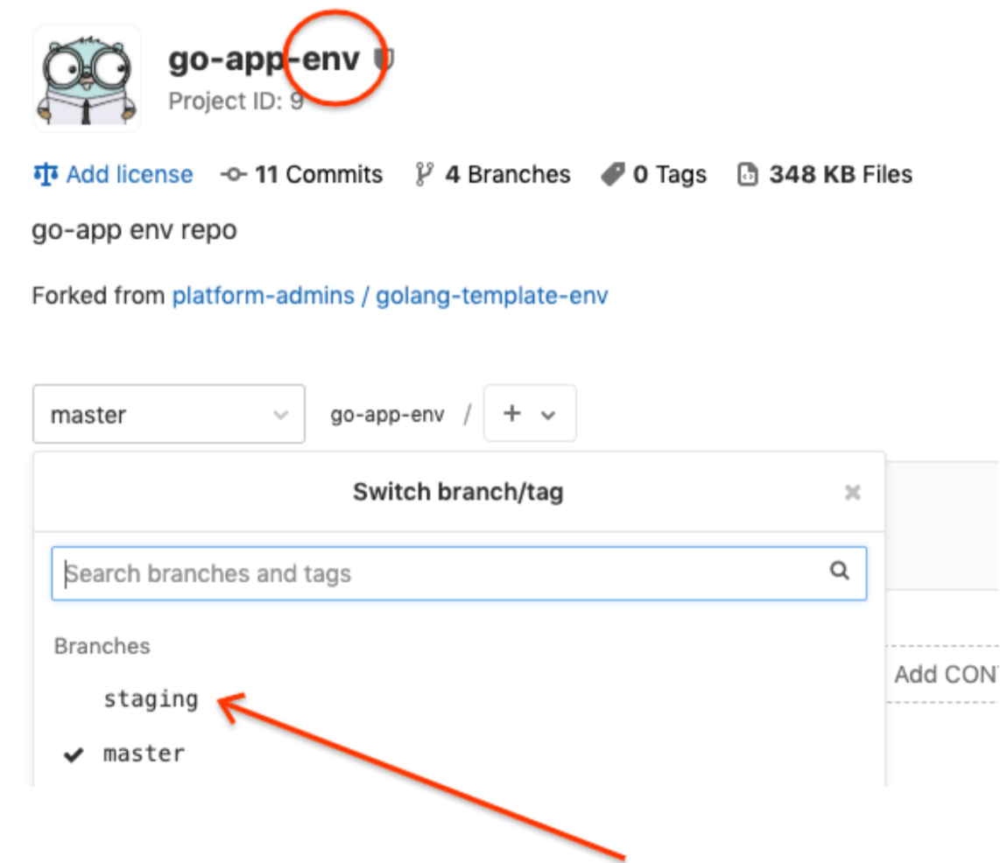
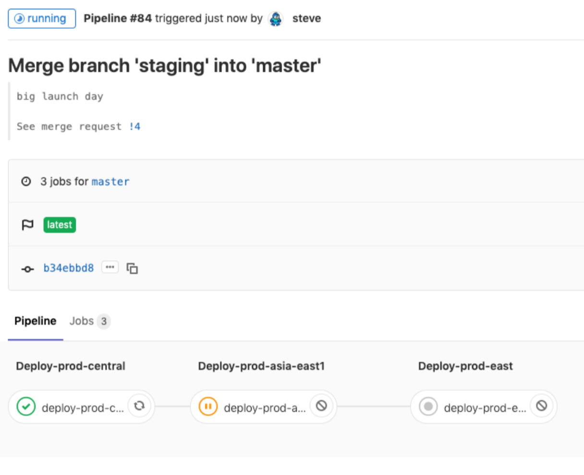
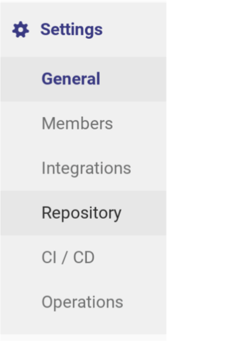
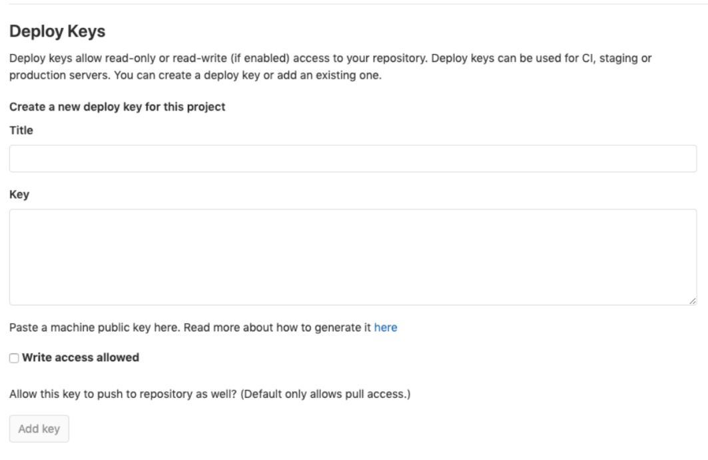

# User Guide

This doc acts as a user guide for onboarding apps to the platform and then updating them.

The following Critical User Journeys (CUJs) are covered:

* [Installation](../README.md#pre-requisites)
* [Adding a new application (using CLI)](#adding-a-new-application-using-cli)
* [Adding a new feature/version of the application](#adding-a-new-featureversion-of-the-application)
  * [Testing the change locally with Skaffold](#testing-the-change-locally-with-skaffold)
  * [Setting up your change for production](#setting-up-your-change-for-production)
* [Promoting changes from Staging to Production](#promoting-changes-from-staging-to-production)
* [Adding a cluster to the platform](#adding-a-cluster-to-the-platform)
* WIP [Deleting an application (using CLI)](#deleting-an-application-using-cli)
* [Deleting an application (manually)](#deleting-an-application-manually)

## Adding a new application (using CLI)

The following instructions use a command line utility ([anthos-platform-cli](cli/) to onboard an application into the system.

1. Download the `anthos-platform-cli` binary to your machine. Take note of getting the binary for the correct operating system.

    [Mac OS](https://storage.googleapis.com/solutions-public-assets/anthos-platform-cli/latest/anthos-platform-cli-vlatest-darwin-amd64)

    [Linux](https://storage.googleapis.com/solutions-public-assets/anthos-platform-cli/latest/anthos-platform-cli-vlatest-linux-amd64)

    [Windows](https://storage.googleapis.com/solutions-public-assets/anthos-platform-cli/latest/anthos-platform-cli-vlatest-windows-amd64)

1. After downloading the binary, rename it and make it executable:

    ```shell
    mv anthos-platform-cli-* anthos-platform-cli
    chmod +x anthos-platform-cli
    ```
1. Run the app creation command:

    ```shell
    ./anthos-platform-cli add app \
      --name $APP_NAME \
      --gitlab-hostname $GITLAB_HOSTNAME \
      --gitlab-token $GITLAB_ROOT_PASSWORD \
      --template-name golang-template
    ```

    * `--name` Application name (i.e. `go-app`)
    * `--gitlab-hostname` Your configured GitLab hostname (i.e. gitlab.your.domain.com)
    * `--gitlab-token` GitLab root user password with the parameter


## Adding a new feature/version of the application

The following steps are performed by a **developer**, and can be performed locally or in Cloud Shell.

### Testing the change locally with Skaffold

1. [Install skaffold](https://skaffold.dev/docs/install/)
1. [Install kustomize](https://github.com/kubernetes-sigs/kustomize/blob/master/docs/INSTALL.md#quickly-curl-the-latest)
1. [Install kubectx/kubens](https://github.com/ahmetb/kubectx/releases)
1. Clone your app repository (example uses the `$APP_NAME` go-app)

    ```shell
    git clone https://@$GITLAB_HOSTNAME/$APP_NAME/$APP_NAME.git
    cd $APP_NAME
    ```

1. Get your shared dev cluster kube context

    ```shell
    gcloud container clusters get-credentials dev-central1
    ```

    Lists your context(s)
    ```shell
    kubectx
    ```

    Rename your context
    ```shell
    kubectx development=$DEV_KUBE_CONTEXT
    ```

1. Switch to the shared dev cluster context

    ```shell
    kubectx development
    ```

1. Create an Artifact Registry repository for your user.

    ```shell
    export PROJECT_ID=$(gcloud config get-value project)
    gcloud beta artifacts repositories create $USER --repository-format=Docker --location=us-central1
    gcloud beta artifacts repositories add-iam-policy-binding --member serviceAccount:tf-sa-dev-us-west1@${PROJECT_ID}.iam.gserviceaccount.com --role roles/artifactregistry.reader --location us-central1 $USER
    ```

1. Set up Docker authentication to the registry.

    ```shell
    gcloud beta auth configure-docker us-central1-docker.pkg.dev
    ```

1. Currently the dev cluster is not managed by ACM so it's likely necessary to create the Dev’s namespace.

    ```shell
    kubectl create namespace $USER
    kubens $USER
    ```

1. Create the Kubernetes Service Account used by the app.

    ```shell
    kubectl create serviceaccount $APP_NAME-ksa
    ```

1. Set your default repository for skaffold to use.

    ```shell
    export PROJECT_ID=$(gcloud config get-value project)
    skaffold config set default-repo us-central1-docker.pkg.dev/$PROJECT_ID/$USER
    ```

1. Run Skaffold in developer mode so that it rebuilds your application as it changes:

    ```shell
    skaffold dev --port-forward
    ```

1. Change code and look at the logs in your console to ensure the expected results. If you are running skaffold on your local machine, point your browser to `http://localhost:8080`, if in Cloud Shell hit the "Web Preview" button.

1. Commit code, push to branch and create a merge request.

1. After CI passes, merge the MR.

### Setting up your change for production

1. After your MR into your app succeeds, the CI pipeline will perform a few actions: unit-test, build, kustomize, push-manifests.

1. The last step, push-manifests actually pushes a file into the app-env repo's staging branch, go check it out and you'll see the output:

    ```console
    remote: To create a merge request for staging, visit:
    remote:   https://gitlab.smcghee.dev/go-team-go/go-app-env/merge_requests/new?merge_request%5Bsource_branch%5D=staging
    ```

1. You can now find your app running in the staging cluster:

     ```shell
     kubectx staging
     kubectl get po -n $APP_NAME
     kubectl get svc -n $APP_NAME
     ```

1. You can port-forward the staging build as well:

     ```shell
     kubectl port-forward svc/$APP_NAME-app -n $APP_NAME 8080:8080
     ```

1. At this point your feature is ready to be deployed to production.  An Operator will perform this.

## Promoting changes from Staging to Production

The following steps are performed by an **Operator**.

1. Once you are ready to deploy whatever is in Staging to the Production clusters (you may pull in many changes from various developers), you will do so by creating a Merge Request in the ${APP}-env **staging** branch onto **master**.
1. In Gitlab UI, navigate to the ${APP}-env repo (not the ${APP} repo).


1. Create a new MR (ie `https://$GITLAB_HOSTNAME/$APP_NAME/$APP_NAME-env/merge_requests`)

1. Get a peer to approve this MR (or approve it yourself if you are feeling lucky)

1. Click "Merge".

1. The CICD in GitLab will kick off your deployment to all clusters, in order:


1. You are live in all production clusters!

If you want to add another cluster (like asia-east1 in the above screenshots), read on!

## Adding a cluster to the platform

1. Create a new GKE cluster:

    ```shell
    gcloud compute regions list  # pick anywhere!`
    ```

    ```shell
    # set the gitlab hostname used during install
    export GITLAB_HOSTNAME="gitlab.ap-123412.cloud-tutorial.dev"
    export NEW_REGION="asia-east1"
    export SHORT_CLUSTERNAME="prod-$NEW_REGION"
    gcloud beta container clusters create $SHORT_CLUSTERNAME \
    --region=$NEW_REGION \
    --release-channel=stable
    ```

1. You should now be in the context of your new cluster:

    ```shell
    kubectl config current-context
    ```

    This should return a line like:
    `gke_smcghee-anthos-platform-demo-0_**asia-east1**_anthos-platform-**prod-asia-east1`**

1. Clone your ACM repo, as hosted in your GitLab instance. You will use this repo in later steps.

    ```shell
    git clone https://$GITLAB_HOSTNAME/platform-admins/anthos-config-management.git
    ```

1. Clone the `shared-ci-cd` and any `${APP}` and `${APP}-env` repos on your local machine, for any apps you want deployed in this new cluster.

    ```shell
    export APP_NAME=go-app
    git clone https://$GITLAB_HOSTNAME/platform-admins/shared-ci-cd.git
    git clone https://$GITLAB_HOSTNAME/$APP_NAME/$APP_NAME.git
    git clone https://$GITLAB_HOSTNAME/$APP_NAME/$APP_NAME-env.git
    ```

1. Setup ACM on the new cluster by applying the config management operator manifest into your newly created cluster:

    ```shell
    gsutil cp gs://config-management-release/released/latest/config-management-operator.yaml config-management-operator.yaml
    kubectl apply -f config-management-operator.yaml
    ```

1. [Install](https://cloud.google.com/anthos-config-management/downloads) the `nomos` CLI locally:

   MacOS - `gsutil cp gs://config-management-release/released/latest/darwin_amd64/nomos nomos`
   
   Linux - `gsutil cp gs://config-management-release/released/latest/linux_amd64/nomos nomos`

1. Create an SSH keypair that nomos can use to authenticate with your ACM Git repository.`

    ```shell
    export NEW_REGION="asia-east1"
    export SHORT_CLUSTERNAME="prod-$NEW_REGION"
    ssh-keygen -t rsa -b 4096 \
       -C "$SHORT_CLUSTERNAME" \
       -N '' \
       -f $SHORT_CLUSTERNAME
    ```

1. Go to the ACM Git repository in GitLab. https://GITLAB_HOSTNAME/platform-admins/anthos-config-management

1. Click on "Settings->Repository"

    

1. In the main pane, click on the "Expand" button in the "Deploy Keys" heading.  You should already see keys for existing production and staging clusters.  
    

1. Use the title "Production $NEW_REGION deploy key" and Paste in the public key (`prod-$NEWREGION.pub`) from the SSH key pair you just created and then click the green "Add key" button.
   Do not check the "write access allowed" checkbox, it only needs read access.
   The key should start with "ssh-rsa" … it should NOT start with "--- BEGIN PRIVATE KEY ---" .. that's the wrong file!

1. Create a secret in your cluster that contains the private key of the SSH key pair.

   ```shell
   export NEW_REGION="asia-east1"
   export SHORT_CLUSTERNAME="prod-$NEW_REGION"
   kubectl create secret generic git-creds --namespace=config-management-system --from-file=ssh=./$SHORT_CLUSTERNAME
   ```

1. Create a Anthos Config Management configuration for your cluster:

   ```shell
   export NEW_REGION="asia-east1"
   export SHORT_CLUSTERNAME="prod-${NEW_REGION}"
   cat > config-management.yaml <<EOF
   apiVersion: configmanagement.gke.io/v1
   kind: ConfigManagement
   metadata:
     name: config-management
   spec:
     # clusterName is required and must be unique among all managed clusters
     clusterName: $SHORT_CLUSTERNAME
     git:
       syncRepo: git@$GITLAB_HOSTNAME:platform-admins/anthos-config-management.git
       syncBranch: master
       secretType: ssh
     policyController:
       enabled: true
   EOF
   ```
  
1. Apply the configuration to your cluster

    ```shell
    kubectl apply -f config-management.yaml
    ```
  
1. Check the status of the installation with the following command. Your cluster should now be synced.

    ```shell
    chmod +x ./nomos
    ./nomos status --contexts $(kubectl config current-context)
    ```

    You should see some output like:

    ```console
    Connecting to clusters...
    Current   Context                                              Status           Last Synced Token   Sync Branch
    -------   -------                                              ------           -----------------   -----------
    *         -demo-0_asia-east1_anthos-platform-prod-asia-east1   SYNCED           18f31861            master
              prod-central                                         SYNCED           18f31861            master
              prod-east                                            SYNCED           18f31861            master
              staging                                              SYNCED           18f31861            master
    ```

1. Now we need to add our new cluster to be usable in ACM:

    ```shell
    export NEW_REGION="asia-east1"
    export SHORT_CLUSTERNAME="prod-${NEW_REGION}"
    cd anthos-config-management
    cat > clusterregistry/$SHORT_CLUSTERNAME.yaml <<EOF
    kind: Cluster
    apiVersion: clusterregistry.k8s.io/v1alpha1
    metadata:
      name: $SHORT_CLUSTERNAME
      labels:
        environment: prod
        clusterName: $SHORT_CLUSTERNAME
    EOF

    cat > clusterregistry/selector-$SHORT_CLUSTERNAME.yaml <<EOF
    kind: ClusterSelector
    apiVersion: configmanagement.gke.io/v1
    metadata:
      name: $SHORT_CLUSTERNAME
    spec:
      selector:
        matchLabels:
          clusterName: $SHORT_CLUSTERNAME
    EOF
    ```

1. For the ACM unit tests to be useful in our new cluster, first add a cluster entry for gitlab runner configmaps and add the configuration of the Gitlab runner for running ACM tests.`

    ```shell
    export NEW_REGION="asia-east1"
    export SHORT_CLUSTERNAME="prod-$NEW_REGION"
    cat >> namespaces/acm-tests/gitlab-runner-configmap-per-cluster.yaml <<EOF
    apiVersion: v1
    kind: ConfigMap
    metadata:
      name: gitlab-runner-config-acm
      annotations:
        configmanagement.gke.io/cluster-selector: $SHORT_CLUSTERNAME
    data:
      CI_SERVER_URL: https://$GITLAB_HOSTNAME/
      KUBERNETES_IMAGE: ubuntu:16.04
      KUBERNETES_NAMESPACE: acm-tests
      REGISTER_LOCKED: "true"
      RUNNER_EXECUTOR: kubernetes
      RUNNER_REQUEST_CONCURRENCY: "1"
      RUNNER_TAG_LIST: app:acm-tests, cluster:$SHORT_CLUSTERNAME
    EOF
    ```

1. Commit the change and push it to your ACM repo

    ```shell
    export NEW_REGION="asia-east1"
    export SHORT_CLUSTERNAME="prod-$NEW_REGION"
    git add namespaces/acm-tests/gitlab-runner-configmap-per-cluster.yaml
    git commit -m "add new cluster: $SHORT_CLUSTERNAME"
    git push origin master
    ```

1. Now, for each app that needs to run in this new cluster, add a file:

    ```shell
    export NEW_REGION="asia-east1"
    export APP_NAME="go-app"

    cd namespaces/managed-apps/$APP_NAME/
    cat >> gitlab-runner-configmap-prod-$NEW_REGION.yaml <<EOF
    apiVersion: v1
    kind: ConfigMap
    metadata:
      name: gitlab-runner-config
      annotations:
        configmanagement.gke.io/cluster-selector: $SHORT_CLUSTERNAME
    data:
      CI_SERVER_URL: "https://$GITLAB_HOSTNAME/"
      CLONE_URL: ""
      RUNNER_REQUEST_CONCURRENCY: "1"
      RUNNER_EXECUTOR: "kubernetes"
      REGISTER_LOCKED: "true"
      RUNNER_TAG_LIST: "app:$APP_NAME, cluster:$SHORT_CLUSTERNAME"
      KUBERNETES_IMAGE: "ubuntu:16.04"
      KUBERNETES_NAMESPACE: "$APP_NAME"
      KUBERNETES_PULL_POLICY: "always"
    EOF
    ```

1. For each repo, push changes:

    ```shell
    git add .
    git commit -m "adding $NEW_REGION"
    git push origin master
    ```

1. Add the new cluster to the Shared CI/CD configuration repo:

    ```shell
    cd platform-admins/shared-ci-cd
    export NEW_REGION="asia-east1"
    cat >> cd/gke-deploy.yaml <<EOF
    deploy-prod-$NEW_REGION:
      # Only deploy when running on master in $APP-env
      only:
        refs:
          - master
      stage: deploy-prod-$NEW_REGION
      image: gcr.io/cloud-builders/gke-deploy:stable
      tags:
      - cluster:prod-$NEW_REGION
      script:
        # Work around for https://github.com/kubernetes/kubernetes/issues/36072
        # Stated solution is to use "--force" or "kubectl create"; gke-deploy does not have this option so the following works
        # Get all services that have the "kubectl.kubernetes.io/last-applied-configuration" annotation and put into an environment variable
        - export SERVICENAMES=$(kubectl get svc -o jsonpath="{range .items[?(@.metadata.annotations.kubectl\.kubernetes\.io/last-applied-configuration)]}{.metadata.name}{':'}{end}")
        # for each service name, remove the annotation
        - echo $SERVICENAMES | tr -d '\n' | tr ':' '\0' | xargs -0 -I {} kubectl annotate svc {} kubectl.kubernetes.io/last-applied-configuration-
        - /gke-deploy run --filename prod.yaml
    EOF
    ```

1. Now make similar changes in your `$APP_NAME-env` repo. This time we're going to make our changes in the `staging` branch, which already was created when we made our app above.

    ```shell
    export APP_NAME="go-app"
    cd $APP_NAME-env
    git checkout staging
    git pull
    cat >> .gitlab-ci.yml <<EOF
    deploy-prod-$NEW_REGION:
      tags:
      - cluster:$SHORT_CLUSTERNAME, app:$APP_NAME
    stages:
    - deploy-$SHORT_CLUSTERNAME
    EOF
    ```

1. Commit the changes:

    ```shell
    git add .gitlab-ci.yml
    git commit -m "adding new cluster to CD"
    git push
    ```

1. Now in the Gitlab web UI, navigate to the link shown in the output of your last git command, which should look like:

    ```console
    remote: To create a merge request for staging, visit:
    remote:   https://$GITLAB_HOSTNAME/$APP_NAME/$APP_NAME-env/merge_requests/new?merge_request%5Bsource_branch%5D=staging`
    ```

1. Choose "Submit merge request".

1. Click "Merge" (don't choose to delete the source branch).

   Note that for $app-env, you will have to push to staging branch first, then perform an MR.

1. Now your deploys will go to your new region too!

## Deleting an application (using CLI)

The following steps are performed by an operator.

1. Run the app removal command:

    ```shell
    ./anthos-platform-cli remove app \
      --name $APP_NAME \
      --gitlab-hostname $GITLAB_HOSTNAME \
      --gitlab-token $GITLAB_ROOT_PASSWORD \
    ```

    * `--name` Application name (i.e. `go-app`)
    * `--gitlab-hostname` Your configured GitLab hostname (i.e. gitlab.your.domain.com)
    * `--gitlab-token` GitLab root user password with the parameter


## Deleting an application (manually)

The following steps are performed by an operator.

1. Clone the `anthos-config-management` repo.

    ```shell
    git clone https://$GITLAB_HOSTNAME/platform-admins/anthos-config-management.git
    ```

1. Create a new branch in the local repo for deleting the app.

    ```shell
    cd anthos-config-management
    git checkout -b delete-$APP_NAME
    ```

1. Delete the app folder under the `namespaces/managed-apps` folder.

    ```shell
    rm -rf namespaces/managed-apps/$APP_NAME
    ```

1. Commit and push the changes back to the repo in the new branch.

    ```shell
    git add .
    git commit -am "deleted app $APP_NAME"
    git push -u origin delete-$APP_NAME
    ```
    
1. Your changes created in a branch need to be merged into the master branch for Anthos Config Management operator to delete > the resources and policies on the GKE clusters.  
    * Create a Merge Request.  
    * The Merge Request is then reviewed and merged into the master branch by a peer Operator.

1. Navigate to the Gitlab web UI, git repository `platform-admins/anthos-config-management`
    * Click on the **Create Merge Request** button on the top banner.
    * Add a suitable title for the Merge request.
    * Click **Submit merge request** at the bottom.
    * Check **Delete source branch** and click **Merge**.

1. Once merged into the master branch, the application and its associated resources i.e. namespace, any deployments and the Gitlab CI runners are deleted by the ACM operator.

1. Navigate to the Google Cloud Console and confirm resources are deleted in the GKE clusters by going to the **Kubernetes Engine > Workloads** page and filtering by **Namespace: go-app**.

1. Delete the Group.  Navigate ot the Gitlab web UI.
    * Select the created application group **Groups > Your groups > `go-app`**  
    * Click on **Settings > General** from the lefthand navbar (expand the lefthand navbar **>>** on the bottom left if necessary)
    * Scroll to the bottom, In the section **Path, transfer, remove**, click **Expand**
    * Click **Remove group**. 
      > NOTE: that deleting the Group also deletes any projects in the group.
    * Enter the Group name again when prompted and click **Confirm**.
      > NOTE: This is an irreversible process.  You cannot recover any removed Groups/Projects.  Proceed with caution!
    
1. When the app was created, an artifact repository storing app container images was created for the application.  This repository can be cleaned up as well.  The default location specified was `us-central1`.

    ```shell
        gcloud beta artifacts repositories delete $APP_NAME --location us-central1
    ```

1. Clean up created service accounts created
    * Remove the `roles/iam.workloadIdentityUser` iam policy binding

    ```shell
    gcloud iam service-accounts remove-iam-policy-binding \
      $APP_NAME-gsa@$PROJECT_ID.iam.gserviceaccount.com \
      --member "serviceAccount:$PROJECT_ID.svc.id.goog[$APP_NAME/$APP_NAME-ksa]" \
      --role roles/iam.workloadIdentityUser
    ```

    * Remove the app gsa service account

    ```shell
    gcloud iam service-accounts delete \
      $APP_NAME-gsa@$PROJECT_ID.iam.gserviceaccount.com \
      --quiet
    ```

    * Remove the app push service account

    ```shell
    gcloud iam service-accounts delete \
      $APP_NAME-push@$PROJECT_ID.iam.gserviceaccount.com \
      --quiet
    ``` 